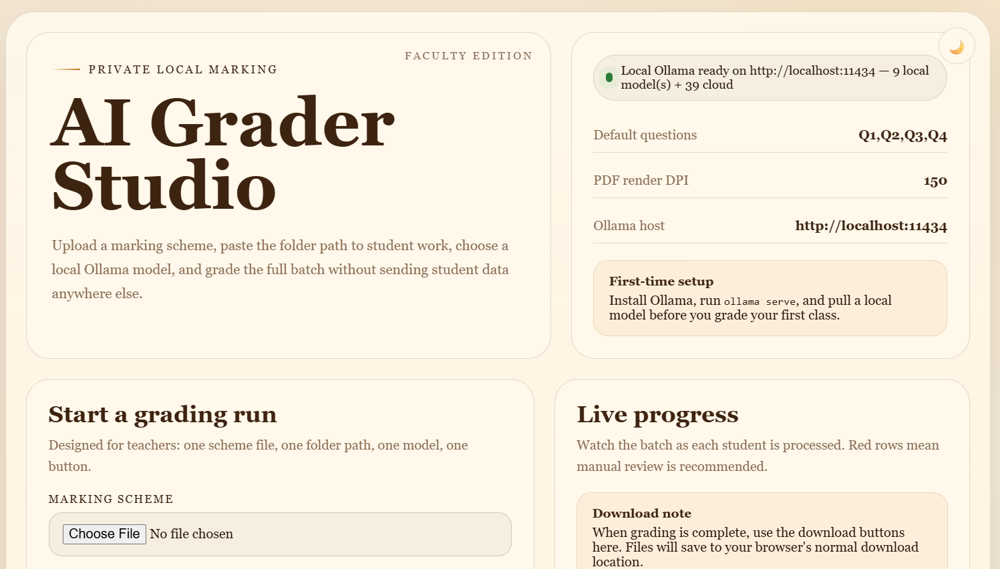

# ai-grader

> Local AI grading assistant for teachers — runs 100% on your machine, no cloud, no data leaks.

[](https://python.org)
[](LICENSE)

---

## Why ai-grader?

- **Privacy-first** — student data never leaves your machine
- **Any format** — PDF (handwritten or typed), Word, plain text
- **Any marking scheme** — paste it as Markdown, PDF, or Word doc
- **Any local model** — works with any Ollama vision model (Gemma, LLaMA, Qwen…)
- **Excel + CSV output** — open straight in Excel or Google Sheets

---

## Requirements

- Python 3.10+
- [Ollama](https://ollama.com/download) running locally
- A vision-capable Ollama model (for handwritten PDFs)

---

## Quickstart

```bash
# 1. Install
pip install -r requirements.txt
pip install -e .

# 2. Pull a model (vision-capable recommended)
ollama pull gemma4:12b

# 3. Mark
ai-grader mark \
  --scheme marking_scheme.md \
  --submissions ./submissions/ \
  --model gemma4:12b
```

Results are saved to `./output/marks.xlsx` and `./output/marks.csv`.

---

## Teacher quickstart (browser app)

For non-technical use, launch the local browser UI instead of working in the terminal:

```bash
# Install the app
pip install -r requirements.txt
pip install -e .

# Start Ollama in a separate terminal
ollama serve

# Pull at least one model
ollama pull gemma4:12b

# Launch the teacher UI
ai-grader gui
```

The app opens in your browser at `http://127.0.0.1:5000` and lets you:

- upload a marking scheme
- paste a submissions folder path
- choose a local Ollama model
- grade the batch and download `marks.xlsx` / `marks.csv`

Demo video: [Watch on YouTube](https://youtu.be/bCerx7UwXhk?si=NacG8KDLwdOvKP07)



---

## Usage

```
ai-grader mark [OPTIONS]

Options:
  -s, --scheme PATH         Marking scheme file (.md, .txt, .pdf, .docx)  [required]
  -d, --submissions PATH    Folder of student submission files             [required]
  -m, --model TEXT          Ollama model name          [default: gemma4:12b]
  -o, --output PATH         Output directory           [default: ./output]
      --format TEXT         Export formats: excel, csv [default: excel,csv]
  -q, --questions TEXT      Question labels            [default: Q1,Q2,Q3,Q4]
      --ollama-host TEXT     Ollama API host            [default: http://localhost:11434]
      --dpi INTEGER         PDF render resolution      [default: 150]
```

### Launch the web UI

```bash
ai-grader gui [OPTIONS]

Options:
      --host TEXT           Host to bind the local web app  [default: 127.0.0.1]
      --port INTEGER        Port to bind the local web app  [default: 5000]
      --no-browser          Do not open the browser automatically
  -q, --questions TEXT      Default question labels shown in the web UI
      --ollama-host TEXT    Ollama API host used by the web UI
      --dpi INTEGER         Default DPI for PDF rendering in the web UI
```

### Example — custom questions

```bash
ai-grader mark \
  --scheme scheme.md \
  --submissions ./class_a/ \
  --questions "Q1,Q2,Q3" \
  --format csv
```

---

## Automated testing

Install test dependencies:

```bash
pip install -e ".[test]"
```

Unit tests run locally without Ollama:

```bash
pytest
```

Live integration tests use a real local Ollama server and model:

```bash
ollama serve
ollama pull gemma4:12b
pytest --run-integration -m integration --ollama-model gemma4:12b
```

Notes:

- Integration tests are opt-in and skipped unless `--run-integration` is provided.
- `--ollama-host` defaults to `OLLAMA_HOST` or `http://localhost:11434`.
- `--ollama-model` defaults to `AI_GRADER_TEST_MODEL` or `gemma4:12b`.
- Current GUI coverage includes route and happy-path stream tests.
- Still needed: reconnect or cancellation coverage and packaged Windows smoke tests.

---

## Windows release build

To build a Windows teacher release, use PyInstaller:

```bash
pip install -e ".[release]"
pyinstaller --noconfirm --clean release/windows/ai-grader-gui.spec
```

On Windows, you can also use:

```powershell
.\scripts\build-windows.ps1
```

This produces a packaged app in `dist/AI-Grader/` and a zip archive in `dist/AI-Grader-windows.zip`.

### Teacher setup checklist

For the first Windows release, teachers still need Ollama installed separately:

1. Install Ollama from `https://ollama.com/download`
2. Run `ollama serve`
3. Pull a recommended model such as `gemma4:12b`
4. Start the packaged AI Grader app
5. Open the browser UI and run grading normally

### Troubleshooting

- If the model dropdown is empty, Ollama is not running or no model is installed.
- If a grading row is flagged red, the result contains `-1` and should be checked manually.
- If the packaged app does not start, confirm Ollama is installed and try launching again.

---

## How it works


1. **Scheme** — loads your marking scheme from any supported format
2. **Detect** — for each submission, detects automatically:
   - Handwritten/scanned PDF → **vision mode** (pages sent as images to the LLM)
   - Typed PDF / Word / text → **text mode** (text extracted, sent as prompt)
3. **Grade** — sends each submission to a locally-running Ollama model with the scheme as context
4. **Export** — writes Excel + CSV with student ID, name, per-question marks, total, and AI reasoning

---

## Supported formats

| File type | Mode |
|-----------|------|
| `.pdf` (handwritten / scanned) | Vision |
| `.pdf` (typed / digital) | Text |
| `.docx` | Text (via MarkItDown) |
| `.txt` / `.md` | Text |

---

## Filename convention (for automatic student ID extraction)

Name your submission files like:

```
StudentName_CourseCode_Year_AssessmentName_StudentID.pdf
```

Example:
```
John_Doe_MATH101_2026A_quiz_D240051A.pdf
```

If the filename doesn't match this pattern, the full filename is used as the student name.

---

## Output

### marks.xlsx
| student_id | name | Q1 | Q2 | Q3 | Q4 | total |
|---|---|---|---|---|---|---|
| D240051A | John Doe | 4 | 5 | 3 | 5 | 17 |

A second **Reasoning** sheet shows the AI's justification for each mark.

Rows with failed marks (`-1`) are highlighted red for manual review.

### marks.csv
Same data as the Marks sheet, plain CSV for Excel/Google Sheets import.

---

## Privacy

- No internet connection required after setup
- No telemetry, no data sent to any cloud service
- All grading happens on your machine via Ollama

---

## Contributing

Pull requests welcome. See [PRD.md](PRD.md) for the product vision and roadmap.

---

## License

MIT
